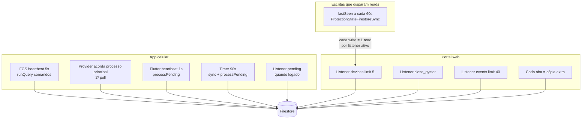

# Plano de otimização Firestore — custo e cota

| Campo | Valor |
|-------|--------|
| **Status** | Aprovado para implementação (jul/2026) |
| **Escopo** | Portal web + app mobile (Flutter + runtime Android) |
| **Motivação** | Esgotamento da cota diária Spark (50k reads); risco de custo no Blaze |
| **Repositórios** | `portal-guardiansense`, `guardianSense` |

---

## Contexto

Em testes de desenvolvimento, o projeto atingiu **~60 mil leituras/dia** no Firestore (limite gratuito: **50 mil**), com pico de **~40 mil leituras em uma hora**. Gravações (~1,6 mil) e exclusões (~79) permaneceram dentro do limite.

Sintomas observados quando a cota esgota:

- Portal fica em **“aguardando o celular”** (`close_oyster` não confirma)
- `lastSeen`, `oysterClosed`, eventos e localização **não atualizam**
- Comandos podem existir como `pending`, mas leituras falham (`RESOURCE_EXHAUSTED`)
- Ao resetar a cota ou fazer login, comandos **pendentes antigos** podem ser aplicados de uma vez (vibração da ostra)

**Conclusão:** parte do comportamento atribuído a bugs de sync era, na verdade, **bloqueio de leituras por cota**. Ainda assim, a arquitetura atual é agressiva demais para dev e escala mal em produção sem otimização.

---

## Diagnóstico: mapa de consumo



### Principais vilões (por impacto)

| # | Fonte | Intervalo | Risco |
|---|--------|-----------|-------|
| 1 | `SystemHeartbeat` → `processPending` | **1s** | Até **3.600 queries/h** com motor ligado |
| 2 | FGS `PortalCommandsFirestoreSync` | **5s** | ~**720 queries/h** |
| 3 | FGS + `PortalCommandSyncProvider` | **dobro** | 2× poll de comandos |
| 4 | Fallback `pageSize=50` se `runQuery` falha | a cada poll | Até **50 reads/poll** — explica pico de 40k/h |
| 5 | `ProtectionStateFirestoreSync` `lastSeen` | **60s** | ~60 writes/h → cada write re-lê listeners do portal |
| 6 | Portal: página Eventos | listener 40 docs | ~46 reads só ao abrir |
| 7 | Múltiplas abas do portal | N× listeners | Multiplica tudo |

### Hipótese do pico (~40k reads em 1h)

FGS + heartbeat Flutter (1s) rodando juntos, possivelmente com `runQuery` falhando (auth/cota) e caindo no **fallback** que lista até **50 documentos** em `commands` a cada ciclo:

`720 polls/h × 50 docs ≈ 36.000 reads/h`

---

## Metas de orçamento

### Plano Spark (grátis)

| Métrica | Limite/dia | Reset |
|---------|------------|-------|
| Leituras | 50.000 | ~meia-noite PT (Pacífico) |
| Gravações | 20.000 | idem |
| Exclusões | 20.000 | idem |

### Plano Blaze (pago)

Leitura custa pouco por unidade (~US$ 0,06 / 100k reads), mas volume alto vira conta relevante. Definir tetos internos:

| Cenário | Leituras/dia alvo | Observação |
|---------|-------------------|------------|
| **Desenvolvimento** | < 20.000 | 1 aparelho, 1 aba portal |
| **Produção (1 usuário)** | < 5.000 | FGS + portal otimizados |
| **Produção (escala)** | linear por usuário | exige push, não poll |

### Alertas no Google Cloud (ao ativar Blaze)

1. Alerta em **50%** do orçamento mensal (ex.: R$ 30)
2. Alerta em **90%**
3. Teto de orçamento opcional (evitar surpresa)

---

## Inventário técnico

### Intervalos atuais

| Intervalo | Onde | Efeito Firestore |
|-----------|------|------------------|
| **1s** | `AppConstants.heartbeatInterval` → `_portalDrain` | `.get()` comandos pending (até 10 docs) |
| **3s** | `PortalCommandSyncTrigger.MIN_INTERVAL_MS` | Throttle sync FGS |
| **5s** | `GuardianForegroundService.HEARTBEAT_INTERVAL_MS` | Comandos + presença + eventos nativos |
| **30s** | `PortalFirestoreSync.RETRY_INTERVAL_MS` | Drain fila eventos nativos |
| **60s** | `ProtectionStateFirestoreSync`, `LocationSyncService` | Writes presença / localização |
| **90s** | `app.dart` `_portalSyncTimer`, `DeviceRegistrationService` | Sync estado + comandos |
| **24h** | Purge comandos (Kotlin + Flutter) | List/delete em batch |

### Portal — listeners

| Arquivo | Query | Limit | Páginas |
|---------|-------|-------|---------|
| `device_repository.dart` | `devices` orderBy `lastSeen` | 5 | Dashboard, Locate, Settings, Devices, Account |
| `user_repository.dart` | `users/{uid}` | 1 doc | via `watchDeviceList` |
| `events_repository.dart` | `devices/{id}/events` | 40 | Eventos |
| `device_commands_repository.dart` | `commands` close_oyster | 1 | Dashboard, Settings |

**Nota:** navegação GoRouter descarta listeners ao trocar rota (sem duplicata simultânea entre páginas). **Múltiplas abas do browser** multiplicam custo.

### App Flutter

| Arquivo | Padrão | Impacto |
|---------|--------|---------|
| `portal_device_commands_service.dart` | listener `pending` + `processPending` sem throttle | Alto |
| `app.dart` | timer 90s + auth login `startListening` | Médio |
| `system_heartbeat.dart` | `_portalDrain` a cada 1s | **Crítico** |
| `device_registration_service.dart` | write estado a cada 90s (com dedupe) | Médio |
| `portal_events_sync_service.dart` | 2 writes por evento | Médio |
| `location_sync_service.dart` | write localização a cada 60s | Médio |

### Android (FGS / runtime)

| Arquivo | Padrão | Impacto |
|---------|--------|---------|
| `GuardianForegroundService.kt` | heartbeat 5s | Alto |
| `PortalCommandsFirestoreSync.kt` | runQuery pending; fallback list 50 | **Crítico** |
| `PortalCommandSyncTrigger.kt` | FGS + wake Provider (2º poll) | Alto |
| `ProtectionStateFirestoreSync.kt` | PATCH `lastSeen` 60s | Médio (dispara reads no portal) |
| `PortalFirestoreSync.kt` | eventos nativos | Médio |
| `CrisisLocationSampler.kt` | localização 3 min (crise) | Baixo |

### Duplicatas cross-cutting

```
Portal envia comando
    → Kotlin FGS (5s poll) aplica + writes
    → Kotlin acorda Main via Provider → segundo poll
    → Flutter listener dispara processPending
    → Flutter heartbeat (1s) processPending
    → Flutter timer (90s) processPending
    → Portal listener close_oyster emite update
```

| Duplicata | Prioridade |
|-----------|------------|
| FGS poll + Provider main poll | **Alta** |
| Flutter listener + heartbeat 1s poll | **Alta** |
| Kotlin presence 60s + Flutter sync 90s | Média |
| Kotlin location crise + Flutter location | Média |
| Portal múltiplas abas | **Alta** |
| Purge portal após cada comando | Média |

---

## Plano de implementação

### Fase 1 — Quick wins (1–2 dias) · redução ~80–95%

Objetivo: parar sangramento sem mudar comportamento visível.

#### App (`guardianSense`)

| # | Mudança | Arquivo(s) | Efeito |
|---|---------|------------|--------|
| 1 | Remover `processPending` do heartbeat 1s | `app.dart`, `system_heartbeat.dart` | −3.600 queries/h |
| 2 | Manter só `drainLockerQueue` no `_portalDrain` | `app.dart` | fila local sem poll Firestore |
| 3 | Com listener ativo: não chamar `processPending` no timer 90s | `app.dart` | −40 queries/h |
| 4 | Usar `processPendingIfDue` (60s) como fallback | `portal_device_commands_service.dart` | código já existe |
| 5 | Não acordar processo principal se FGS processou OK | `PortalCommandSyncTrigger.kt` | −50% polls |
| 6 | Intervalo adaptativo FGS: 30s idle, 5s com pending | `GuardianForegroundService.kt` | −80% polls idle |
| 7 | Fallback seguro: sem `pageSize=50` ou limit 10 + log | `PortalCommandsFirestoreSync.kt` | evita pico 40k/h |

#### Portal (`portal-guardiansense`)

| # | Mudança | Arquivo(s) | Efeito |
|---|---------|------------|--------|
| 8 | Não rodar purge após cada comando | `device_commands_repository.dart` | −20 reads/comando |
| 9 | `eventsListenLimit` 40 → 15 | `events_repository.dart` | −25 reads ao abrir Eventos |
| 10 | Aviso dev: usar uma aba do portal | UI settings ou banner | evita N× listeners |

**Estimativa pós-Fase 1:** de ~60k/dia em teste → **~3–8k/dia** (1 device, 1 aba, sessão de teste).

---

### Fase 2 — Arquitetura (3–5 dias)

#### Portal: hub de streams compartilhado

```
AuthScope
  └── DeviceStreamHub (singleton)
        ├── watchPrimaryDevice()   ← 1 listener para Dashboard, Locate, Settings…
        └── watchCommandStatus()   ← 1 listener para RemoteContainmentCard
```

- Um listener de `devices` para todo o portal autenticado
- Eventos: listener **só com aba Eventos visível**
- Dashboard: resumo no device doc; timeline sob demanda

#### App: writer único de presença

| Campo | Writer |
|-------|--------|
| `lastSeen`, `runtimeActive`, `oysterClosed` | **só FGS (Kotlin)** |
| `protectionChecklist`, `protectedLayers` | **só Flutter** (quando mudar) |
| `lastLocation` | **só Kotlin em crise**; Flutter só sync manual |

#### Eventos: reduzir writes

Hoje `publishEvent` = **2 writes** (device + `events/{id}`).

Opções:

- **A)** Só subcoleção `events`
- **B)** Resumo no device + timeline paginada
- **C)** Cloud Function espelha (baixo volume)

**Estimativa pós-Fase 2:** produção 1 usuário **< 2k reads/dia** idle.

---

### Fase 3 — Escala e governança

| Item | Quando | Benefício |
|------|--------|-----------|
| **FCM** para acordar sync em comando novo | > 50 usuários | zera poll idle |
| Cloud Function `onCreate` em `commands` | médio prazo | push vs poll 5s |
| TTL / purge automático `commands` applied | contínuo | menos docs no fallback |
| Revisão de índices Firestore | antes de escalar | queries mais baratas |
| Dashboard Usage no Firebase Console | contínuo | visibilidade |

---

## PRs sugeridos

| PR | Repositório | Escopo | Impacto |
|----|-------------|--------|---------|
| **PR1** | app | Tirar `processPending` do heartbeat 1s | Crítico |
| **PR2** | app | Intervalo adaptativo FGS + sem double-poll | Crítico |
| **PR3** | app | Fallback seguro em `PortalCommandsFirestoreSync` | Crítico |
| **PR4** | portal | Purge + events limit 15 | Médio |
| **PR5** | portal | `DeviceStreamHub` singleton | Médio |
| **PR6** | app | Writer único presença/localização | Médio |

---

## Regras de ouro (desenvolvimento)

1. **Uma aba** do portal aberta durante testes
2. **Fechar app** ou parar FGS quando não testar background
3. **Limpar** `users/{uid}/devices/{id}/commands` antes de sessão de teste
4. **Não deixar** motor Flutter + FGS + portal aberto overnight
5. Conferir **Firebase Console → Usage** no fim do dia de teste
6. Ao ativar Blaze: configurar **alertas de orçamento** antes de testar

---

## Limpeza Firestore para teste limpo

```
users/{uid}
└── devices/{deviceId}
    ├── commands/{commandId}   ← apagar (evita close_oyster pendente no login)
    └── events/{eventId}       ← apagar (timeline limpa)
```

- Apagar `commands` é suficiente para evitar vibração inesperada no login
- Perfil (`users/{uid}`) e device são recriados pelo app no próximo login
- `deviceId` é estável por aparelho (ANDROID_ID)

---

## O que não mudar (por enquanto)

- Listener `pending` no Flutter quando logado — eficiente (só lê quando muda)
- Throttle 30s entre comandos no portal — bom para UX e custo
- Purge 7 dias no app (1×/dia) — adequado

---

## Estimativas consolidadas

| Cenário | Reads/h | Writes/h |
|---------|---------|----------|
| Portal dashboard + FGS idle, fila vazia | 60–80 | ~60 |
| Portal eventos aberto | 100–150 + novos eventos | ~60 + eventos |
| App FGS, fila vazia (atual) | ~1.440 queries (0 doc reads) | ~60 |
| App Flutter + motor (atual) | +~3.600 queries | +0–40 |
| Comando pending ativo (atual) | +10 reads/query × todos pollers | ~5–10/comando |

---

## Referências de código

**Portal**

- `lib/features/devices/data/device_repository.dart`
- `lib/features/events/data/events_repository.dart`
- `lib/features/containment/data/device_commands_repository.dart`
- `lib/features/dashboard/application/dashboard_service.dart`

**App Flutter**

- `lib/app/app.dart`
- `lib/core/heartbeat/system_heartbeat.dart`
- `lib/core/constants/app_constants.dart` (`heartbeatInterval = 1s`)
- `lib/features/containment/application/portal_device_commands_service.dart`

**Android**

- `android/.../GuardianForegroundService.kt`
- `android/.../portal/PortalCommandsFirestoreSync.kt`
- `android/.../portal/PortalCommandSyncTrigger.kt`
- `android/.../portal/ProtectionStateFirestoreSync.kt`

**Regras**

- `firestore.rules` — limites de comandos e ownership

---

## Histórico

| Data | Evento |
|------|--------|
| jul/2026 | Cota Spark esgotada (~60k reads); plano documentado |
| jul/2026 | Vibração no login explicada por `close_oyster` pending + sync pós-auth |
| 14/jul/2026 | Portal: `deviceOnlineThreshold` 90s → **5 min** (alinhado a presença FGS ~180s no app) |
